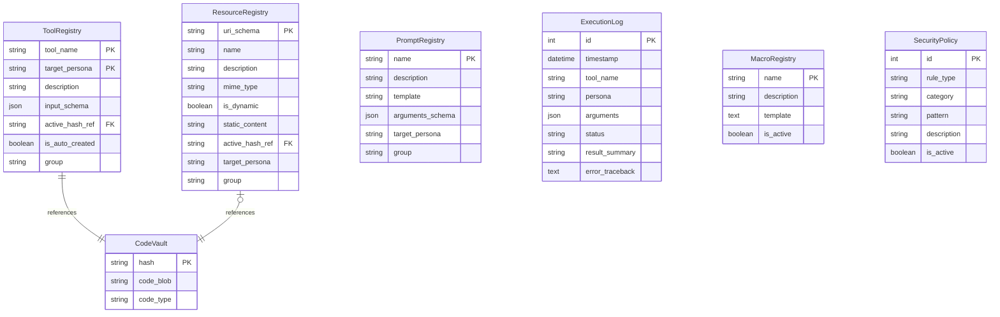

# Chameleon Data Model

This document details the database schema for the Chameleon MCP Server. The system uses **SQLModel** (SQLAlchemy + Pydantic) to define the schema.

## Entity Relationship Diagram

## Schema Details

### 1. ToolRegistry
Stores definitions for all available tools.

| Column | Type | Description |
|--------|------|-------------|
| `tool_name` | `str` (PK) | Unique name of the tool (namespaced, e.g., `utility_greet`). |
| `target_persona` | `str` (PK) | The persona this tool is available to (e.g., `default`). |
| `description` | `str` | Human-readable description of what the tool does. |
| `input_schema` | `dict` (JSON) | JSON Schema defining required arguments. |
| `active_hash_ref` | `str` (FK) | Reference to `CodeVault.hash` containing the implementation code. |
| `is_auto_created` | `bool` | `True` if created by LLM, `False` if system/static. |
| `group` | `str` | Category for organization (e.g., `utility`, `math`). **Required**. |

### 2. ResourceRegistry
Stores static and dynamic resources.

| Column | Type | Description |
|--------|------|-------------|
| `uri_schema` | `str` (PK) | URI pattern identifying the resource (e.g., `system://time`). |
| `name` | `str` | Human-readable name (namespaced, e.g., `system_time`). |
| `description` | `str` | Description of the resource content. |
| `mime_type` | `str` | MIME type (e.g., `text/plain`, `application/json`). |
| `is_dynamic` | `bool` | If `True`, executes code from `CodeVault`. |
| `static_content` | `str` | Hardcoded content for static resources (nullable). |
| `active_hash_ref` | `str` (FK) | Reference to `CodeVault.hash` if dynamic. |
| `target_persona` | `str` | Target persona (e.g., `default`). |
| `group` | `str` | Category for organization. **Required**. |

### 3. PromptRegistry
Stores prompt templates.

| Column | Type | Description |
|--------|------|-------------|
| `name` | `str` (PK) | Unique name of the prompt (namespaced). |
| `description` | `str` | Description of the prompt's purpose. |
| `template` | `str` | Jinja2 or f-string template text. |
| `arguments_schema`| `dict` (JSON) | JSON Schema for arguments used in the template. |
| `target_persona` | `str` | Target persona (e.g., `default`). |
| `group` | `str` | Category for organization. **Required**. |

### 4. CodeVault
Stores immutable code blobs, referenced by their SHA-256 hash.

| Column | Type | Description |
|--------|------|-------------|
| `hash` | `str` (PK) | SHA-256 hash of the `code_blob`. |
| `code_blob` | `str` | The actual source code (Python or SQL). |
| `code_type` | `str` | Type of code: `python` or `select`. |

### 5. ExecutionLog
Audit trail for tool executions ("Black Box" recorder).

| Column | Type | Description |
|--------|------|-------------|
| `id` | `int` (PK) | Auto-incrementing ID. |
| `timestamp` | `datetime` | UTC timestamp of execution. |
| `tool_name` | `str` | Name of the tool executed. |
| `persona` | `str` | Persona context used. |
| `arguments` | `dict` (JSON) | Arguments passed to the tool. |
| `status` | `str` | `SUCCESS` or `FAILURE`. |
| `result_summary` | `str` | Truncated result output (for quick review). |
| `error_traceback` | `text` | Full Python traceback if status is FAILURE. |

### 6. MacroRegistry
Reusable Jinja2 macros for SQL tools.

| Column | Type | Description |
|--------|------|-------------|
| `name` | `str` (PK) | Macro name (e.g., `safe_div`). |
| `description` | `str` | Description of utility. |
| `template` | `text` | Jinja2 macro definition block. |
| `is_active` | `bool` | Controls visibility/availability. |

### 7. SecurityPolicy
Dynamic AST-based security rules.

| Column | Type | Description |
|--------|------|-------------|
| `id` | `int` (PK) | Auto-incrementing ID. |
| `rule_type` | `str` | `allow` or `deny` (Deny takes precedence). |
| `category` | `str` | `module`, `function`, or `attribute`. |
| `pattern` | `str` | Name to match (e.g., `subprocess`). |
| `description` | `str` | Reason for policy. |
| `is_active` | `bool` | Controls enforcement. |
