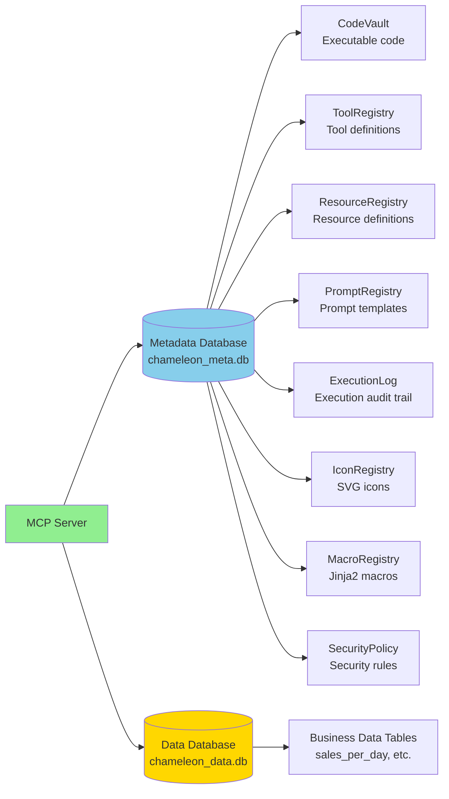
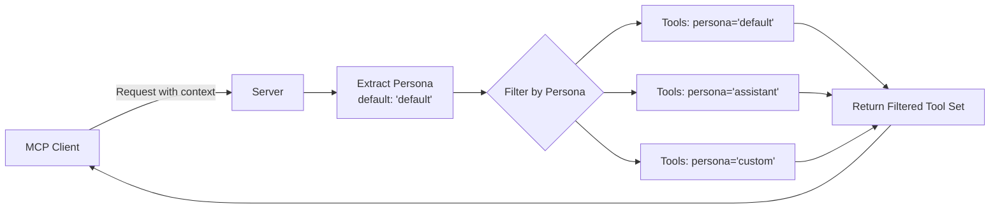
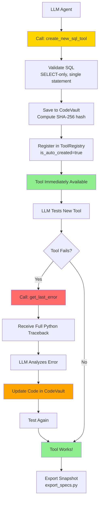
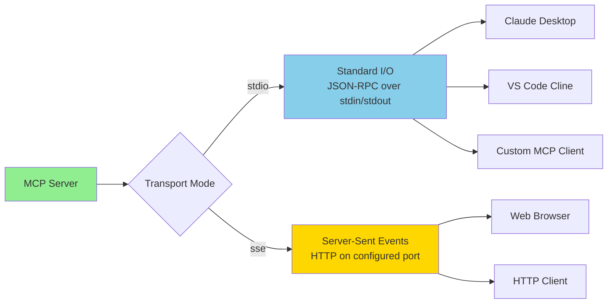
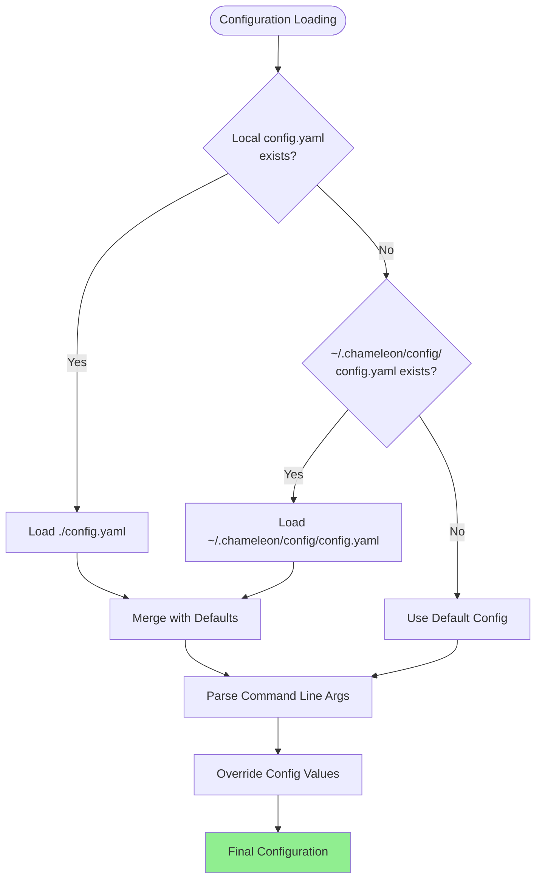
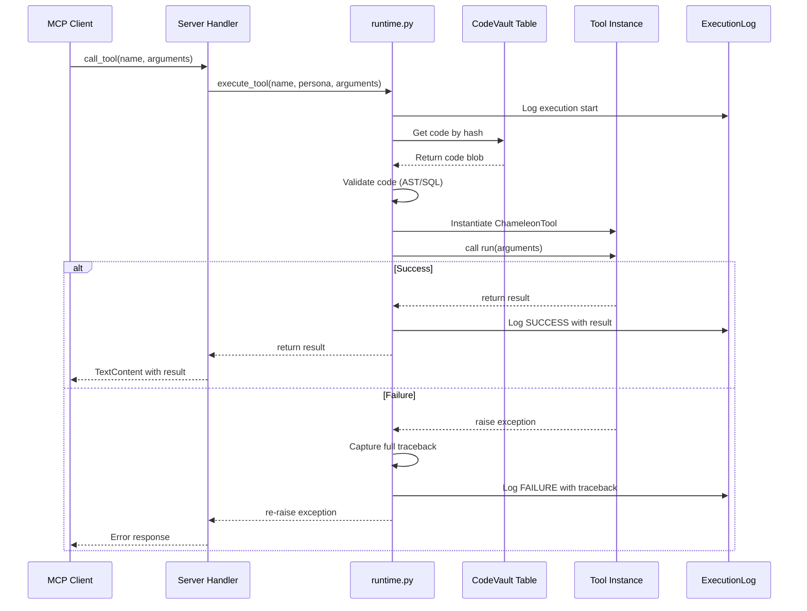
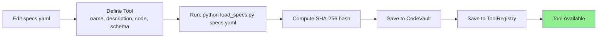
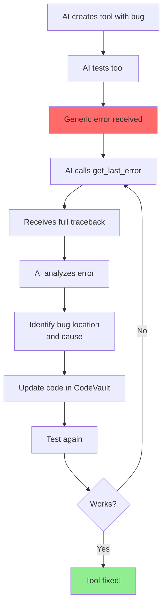

# Chameleon MCP Server Flow Chart

This document provides a comprehensive visual flow chart of how the Chameleon MCP Server operates, from initialization through request handling.

## Complete Server Flow

```mermaid
flowchart TD
    Start([Server Start]) --> LoadConfig[Load Configuration<br/>config.yaml or defaults]
    LoadConfig --> ParseArgs[Parse Command Line Args<br/>Override config values]
    ParseArgs --> SetupLogging[Setup Logging<br/>Create log files]
    SetupLogging --> Lifespan[Enter Lifespan Context]
    
    Lifespan --> InitMeta[Initialize Metadata Database<br/>sqlite:///chameleon_meta.db]
    InitMeta --> CreateMetaTables[Create Metadata Tables<br/>CodeVault, ToolRegistry, etc.]
    CreateMetaTables --> InitData{Initialize Data Database}
    
    InitData -->|Success| CreateDataTables[Create Data Tables<br/>sales_per_day, etc.]
    InitData -->|Failure| OfflineMode[Set Offline Mode<br/>data_db_connected = False]
    
    CreateDataTables --> DataConnected[data_db_connected = True]
    DataConnected --> CheckEmpty
    OfflineMode --> CheckEmpty
    
    CheckEmpty{Database<br/>Empty?}
    CheckEmpty -->|Yes| AutoSeed[Auto-Seed Database<br/>Load default tools, resources, prompts]
    CheckEmpty -->|No| Ready
    AutoSeed --> Ready[Server Ready]
    
    Ready --> Listen{Wait for<br/>MCP Request}
    
    Listen -->|list_tools| HandleListTools[Handle List Tools]
    Listen -->|call_tool| HandleCallTool[Handle Call Tool]
    Listen -->|list_resources| HandleListRes[Handle List Resources]
    Listen -->|read_resource| HandleReadRes[Handle Read Resource]
    Listen -->|list_prompts| HandleListPrompts[Handle List Prompts]
    Listen -->|get_prompt| HandleGetPrompt[Handle Get Prompt]
    Listen -->|completion| HandleCompletion[Handle Completion]
    
    HandleListTools --> GetPersona[Get Persona from Context<br/>default: 'default']
    GetPersona --> QueryTools[Query ToolRegistry<br/>Filter by persona]
    QueryTools --> LoadIcons[Load Tool Icons<br/>from IconRegistry]
    LoadIcons --> ReturnTools[Return Tool Objects]
    ReturnTools --> Listen
    
    HandleCallTool --> ExtractFormat[Extract _format argument<br/>json or toon]
    ExtractFormat --> GetPersona2[Get Persona from Context]
    GetPersona2 --> GetEngines[Get Database Engines<br/>meta_engine + data_engine]
    GetEngines --> CreateSessions[Create Database Sessions]
    CreateSessions --> ExecuteTool[Execute Tool via runtime.py]
    
    ExecuteTool --> LogStart[Log Execution Start<br/>to ExecutionLog]
    LogStart --> LookupTool{Find Tool<br/>in Registry?}
    
    LookupTool -->|Not Found| CheckTemp{Check Temp<br/>Registry?}
    CheckTemp -->|Found| LoadTempCode[Load from TEMP_CODE_VAULT]
    CheckTemp -->|Not Found| ToolNotFound[Raise ToolNotFoundError]
    
    LookupTool -->|Found| GetCodeHash[Get active_hash_ref]
    GetCodeHash --> LookupCode{Find Code<br/>in CodeVault?}
    
    LookupCode -->|Found| ValidateHash[Validate Code Integrity<br/>SHA-256 hash check]
    LookupCode -->|Not Found| CodeNotFound[Raise Error: Code not found]
    
    ValidateHash --> CheckCodeType{Code Type?}
    
    CheckCodeType -->|python| ValidateAST[AST Validation<br/>Check code structure]
    CheckCodeType -->|select| ValidateSQL[SQL Validation<br/>SELECT-only, single statement]
    
    ValidateAST --> InstantiateClass[Find ChameleonTool Subclass<br/>Instantiate with context]
    ValidateSQL --> RenderJinja[Render Jinja2 Template<br/>with arguments]
    
    InstantiateClass --> RunMethod[Call tool.run&#40;arguments&#41;]
    RenderJinja --> BindParams[Bind Parameters<br/>SQLAlchemy params]
    
    RunMethod --> Success{Execution<br/>Success?}
    BindParams --> ExecuteQuery[Execute SQL Query]
    ExecuteQuery --> Success
    
    Success -->|Yes| LogSuccess[Log Success to ExecutionLog<br/>status='SUCCESS']
    Success -->|No| CaptureError[Capture Full Traceback<br/>traceback.format_exc&#40;&#41;]
    
    CaptureError --> LogFailure[Log Failure to ExecutionLog<br/>status='FAILURE', error_traceback]
    LogFailure --> RaiseError[Re-raise Original Exception]
    
    LogSuccess --> NormalizeResult[Normalize Result<br/>Handle SQLModel objects]
    NormalizeResult --> FormatOutput{Output<br/>Format?}
    
    FormatOutput -->|json| FormatJSON[JSON.dumps with indent]
    FormatOutput -->|toon| FormatTOON[TOON encode<br/>if library available]
    
    FormatJSON --> ReturnContent[Return TextContent]
    FormatTOON --> ReturnContent
    ReturnContent --> Listen
    
    RaiseError --> ErrorResponse[Return Error to Client]
    ErrorResponse --> Listen
    ToolNotFound --> ErrorResponse
    CodeNotFound --> ErrorResponse
    
    HandleListRes --> QueryResources[Query ResourceRegistry<br/>Filter by persona]
    QueryResources --> ReturnResources[Return Resource Objects]
    ReturnResources --> Listen
    
    HandleReadRes --> FindResource{Find Resource<br/>by URI?}
    FindResource -->|Not Found| ResourceNotFound[Raise ResourceNotFoundError]
    FindResource -->|Found| CheckDynamic{Is Dynamic<br/>Resource?}
    
    CheckDynamic -->|Yes| ExecuteResCode[Execute Resource Code<br/>from CodeVault]
    CheckDynamic -->|No| ReturnStatic[Return static_content]
    
    ExecuteResCode --> ReturnResContent[Return Resource Content]
    ReturnStatic --> ReturnResContent
    ReturnResContent --> Listen
    ResourceNotFound --> ErrorResponse
    
    HandleListPrompts --> QueryPrompts[Query PromptRegistry<br/>Filter by persona]
    QueryPrompts --> ReturnPrompts[Return Prompt Objects]
    ReturnPrompts --> Listen
    
    HandleGetPrompt --> FindPrompt{Find Prompt<br/>by name?}
    FindPrompt -->|Not Found| PromptNotFound[Raise PromptNotFoundError]
    FindPrompt -->|Found| FormatPrompt[Format Template<br/>with arguments]
    FormatPrompt --> ReturnPromptMsg[Return PromptMessage]
    ReturnPromptMsg --> Listen
    PromptNotFound --> ErrorResponse
    
    HandleCompletion --> GetCompletions[Get Tool Completions<br/>via runtime.py]
    GetCompletions --> ReturnCompletions[Return Completion List]
    ReturnCompletions --> Listen
    
    style Start fill:#90EE90
    style Ready fill:#90EE90
    style Listen fill:#87CEEB
    style ExecuteTool fill:#FFD700
    style LogSuccess fill:#90EE90
    style LogFailure fill:#FF6B6B
    style ErrorResponse fill:#FF6B6B
    style ReturnTools fill:#90EE90
    style ReturnContent fill:#90EE90
    style ReturnResources fill:#90EE90
    style ReturnPrompts fill:#90EE90
```

## Key Components

### 1. Initialization Flow
- **Configuration Loading**: Loads from `config.yaml` (local or `~/.chameleon/config/config.yaml`) with fallback to defaults
- **Database Initialization**: 
  - Metadata database (required): Stores tools, resources, prompts, code
  - Data database (optional): Stores business data, can fail without breaking server
- **Auto-Seeding**: If metadata database is empty, automatically populates with default tools

### 2. Request Handling
The server implements standard MCP protocol handlers:
- `list_tools`: Returns tools filtered by persona
- `call_tool`: Executes tool code and returns result
- `list_resources`: Returns available resources
- `read_resource`: Retrieves resource content (static or dynamic)
- `list_prompts`: Returns prompt templates
- `get_prompt`: Formats prompt with arguments
- `completion`: Provides autocomplete suggestions

### 3. Tool Execution Flow
1. **Persona Resolution**: Determines which persona is making the request
2. **Tool Lookup**: Searches ToolRegistry (database) or TEMP_TOOL_REGISTRY (in-memory)
3. **Code Retrieval**: Fetches code from CodeVault using hash reference
4. **Validation**:
   - **Python tools**: AST validation ensures only class definitions and imports
   - **SQL tools**: Validates SELECT-only, single statement, no SQL injection
5. **Execution**:
   - **Python**: Instantiates ChameleonTool subclass, calls `run(arguments)`
   - **SQL**: Renders Jinja2 template, binds parameters, executes query
6. **Logging**: All executions logged to ExecutionLog with full tracebacks on failure
7. **Result Formatting**: Supports JSON (default) or TOON format

### 4. Security Features
- **Hash Integrity**: SHA-256 verification prevents code tampering
- **AST Validation**: Python code checked for safe structure
- **SQL Injection Prevention**: 
  - Jinja2 used only for structure (WHERE clauses, JOINs)
  - SQLAlchemy parameter binding for all values
  - SELECT-only enforcement
- **Persona-Based Filtering**: Different tool sets for different contexts

### 5. Error Handling
- **Execution Logging**: All failures captured with full Python tracebacks
- **Independent Persistence**: Execution logs saved even if main transaction fails
- **Self-Healing Support**: `get_last_error` tool allows AI agents to diagnose and fix bugs

## Database Architecture

### Dual Database Design
- **Metadata Database** (Required): Contains all server configuration, tools, and code
- **Data Database** (Optional): Contains business/application data
- **Offline Mode**: Server continues functioning if data database is unavailable
- **Reconnection**: `reconnect_db` tool allows runtime reconnection to data database

## Persona System

Personas allow different tool sets for different contexts:
- **default**: Standard tools for all users
- **assistant**: Specialized assistant tools
- **custom**: User-defined personas

## Self-Modifying Architecture

The server supports self-modifying AI agents:
1. **Tool Creation**: LLMs can create SQL tools via `create_new_sql_tool` meta-tool
2. **Immediate Availability**: Created tools are instantly usable
3. **Self-Healing**: Full traceback logging enables AI self-diagnosis and repair
4. **Tracking**: `is_auto_created` flag distinguishes LLM-created vs. system tools

## Transport Modes

Two transport options:
- **stdio** (default): Standard input/output for desktop clients
- **sse**: HTTP Server-Sent Events for web-based clients

## Configuration Hierarchy

Configuration priority (highest to lowest):
1. Command-line arguments
2. Local `config.yaml` (current directory)
3. User `~/.chameleon/config/config.yaml`
4. Default values

## Tool Execution Lifecycle

Key aspects:
1. **Pre-execution Logging**: Execution attempt logged before execution
2. **Independent Logging**: Logs persist even if main transaction fails
3. **Full Traceback Capture**: Python traceback with line numbers preserved
4. **Exception Re-raising**: Original exception passed to client unchanged

## Advanced Features

### Temporary Tools and Resources
- In-memory registries for runtime-only tools/resources
- Useful for testing without database persistence
- Automatically checked if database lookup fails

### Macro System
- Reusable Jinja2 macros stored in MacroRegistry
- Automatically loaded and prepended to SQL templates
- Enables DRY (Don't Repeat Yourself) SQL patterns

### Icon Support
- SVG icons stored in IconRegistry
- Associated with tools via `icon_name` field
- Supports base64 encoding for transport
- Fallback to default chameleon icon

### Quality Control
- `system_verify_tool` for confidence building
- Manual verification examples stored in database
- Helps establish trust in tool execution

## Common Workflows

### Adding a New Tool (YAML Method)

### AI Self-Healing Workflow

## Related Documentation
- [Server README](README.md) - Complete server documentation
- [SQL Creator Tool](SQL_CREATOR_TOOL_README.md) - Dynamic SQL tool creation
- [Execution Log](EXECUTION_LOG_README.md) - Execution logging and debugging
- [Data Model](DATA_MODEL.md) - Database schema and relationships
- [Macro Registry](MACRO_REGISTRY_README.md) - Reusable Jinja2 macros
- [Advanced Tools](ADVANCED_TOOLS_README.md) - Meta-tools and advanced features
